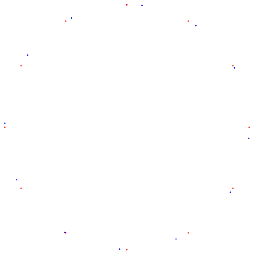

## Pythagorean fifths on the unit circle

Any point, $(x,y)$, on the unit circle can be expressed as

$$ (x,y)=(\cos \theta, \sin \theta). $$

That is, the $x$ and $y$ coordinates are $\cos \theta$ and $\sin \theta$, respectively, where $\theta$ is the angle that a ray from the origin to the point makes with the $x-$axis, measured positive counterclockwise. You may remember this from high school algebra/trig. Equivalently, any point on the unit circle in the complex plane can be written $e^{i \theta}$. For example, the point $(1,0)$ corresponds to $\theta=0$, and $(0,1)$ corresponds to $\theta=\frac{\pi}{2}$.

For our purposes you can think of starting at the top of the circle (0,1) and measuring angle positive clockwise, as this is the circle of fifths convention that people are familiar with. We use this convention for the plots below but it makes no difference as far as the math goes. 
 
We can identify musical intervals with points on the circle by defining $\theta$ for a given interval. We would like our definition to have the following properties:

-   We would like an octave to correspond to $\theta=2\pi$, a full rotation around the circle.
-   We would like the angle for stacked intervals to be obtained by adding the corresponding angles.

So we define, for an interval with frequency ratio $r$,

$$ f(r)=2\pi \log_2 r. $$

It is readily seen that the function $f$ has the desired properties. For example, since an octave has ratio 2, we see that $f(2)=2\pi$. To see that the equation satisfies the second property, suppose that $f(r_1)=\theta_1$ and $f(r_2)=\theta_2$. Recall that the ratio for the stacked interval with ratios $r_1$ and $r_2$ is the product $r_1r_2$, and by properties of logarithms we have

$$ f(r_1r_2) = 2\pi \log_2(r_1r_2) = 2\pi \log_2 r_1 + 2\pi \log_2 r_2 = f(r_1) + f(r_2). $$

So we simply add the angles.

Using the property of stacked intervals, the ratio for one half-step must satisfy $r^{12}=2$, which gives $r=2^{1/12}\approx 1.059463094$. We find

$$ f(2^{1/12}) = \frac{2\pi}{12} = \frac{\pi}{6} $$

So that the points on the unit circle for the twelve tones of the even-tempered scale are all equally spaced at intervals of $\pi/6 = 30$ degrees. Also, notes outside the octave simply wrap around the circle. 

The following figures show the twelve even-tempered scale notes, and the scale generated from the Pythagorean fifth, for which $r=\frac{3}{2}$.

#### Twelve Even-Tempered and Pythagorean Tones

The root/octave is at the top. The even tempered are in blue while the pythagorean are in red.

You can see the fifth is where they match the closest down at south-southwest The gap there in terms of frequency ratio is

$$ \frac{3/2}{2^{7/12}} \approx 1.001129891
$$ The gap in terms of degrees on the circle is $$
360(\log_2 \frac{3}{2} - \frac{7}{12}) \approx 0.5865003 \ degrees
$$

#### Twelve Tones with the First Five Pythagorean Fifths

Here is what it looks like when we keep stacking Pythagorean fifths

#### 100 notes in the Pythagorean scale

The 12 even tempered notes are also shown, in red.

#### 200 notes in the Pythagorean scale

#### 500 notes in the Pythagorean scale

#### Infinite tones

An interesting problem is to describe the situation as the number of tones increases. With $n$ tones, if we give each point, $p_i$, on the circle a weight of $1/n$, the total weight is then 1 for any $n$. Then you have a *probability measure* on the circle consisting of point masses. Using Weyl's Equidistribution Theorem one can show that as

$n \rightarrow \infty$ these probability measures converge to a continuous probability density function on the circle (or the interval $(0, 2\pi]$, take your pick). There are many ways to define convergence of functions, sequences, measures, etc. In this particular case the convergence is in the so called *weak-star* topology on the space of measures. Despite the esoteric sounding name, this convergence is very intuitive. We can define it this way:

Let $\theta_i, i = 1, 2, 3, ..., n$ be the angles of the points on the circle resulting from stacking pythagorean fifths. The associated point mass measures converge to the uniform distribution in the weak star topology if, for any continuous function $f$, we have 

$$
\lim_{n \rightarrow \infty} \frac{1}{n} \sum_{i = 1}^n f(\theta_i) = \frac{1}{2\pi}\int_0^{2\pi} \ f(\theta) \ d\theta
$$